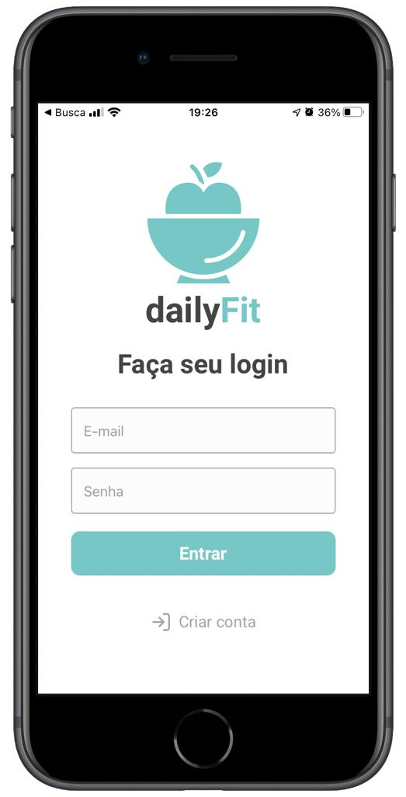
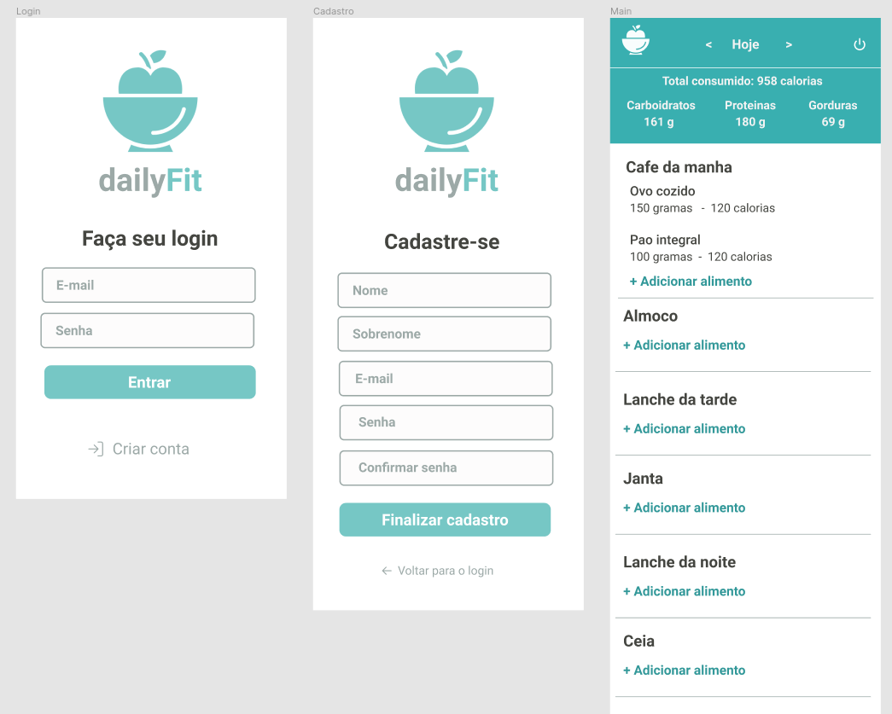

# <h1 align="center" style="color:#444540">dailyFit</h1>

# 

## :gear: ... Under development

Currently in a very early development stage.

A Node API for the application is also being developed. You can check it [here](https://github.com/leonardorib/dailyfit-api).

## :notebook_with_decorative_cover: About

Designed to facilitate diets, counting total calories, proteins, carbohydrates and fats ingestion during the day, and mantaining a history of that data.

Inspired on applications such as MyFitnessPal.

This is an independent and personal project, with no commercial motivation. The main purpose is to practice and have fun ;).

## :rocket: Technologies

- Typescript
- React
- React Native
- Expo
- Styled-components

## :computer: Design Preview

Design preview, built on Figma:

